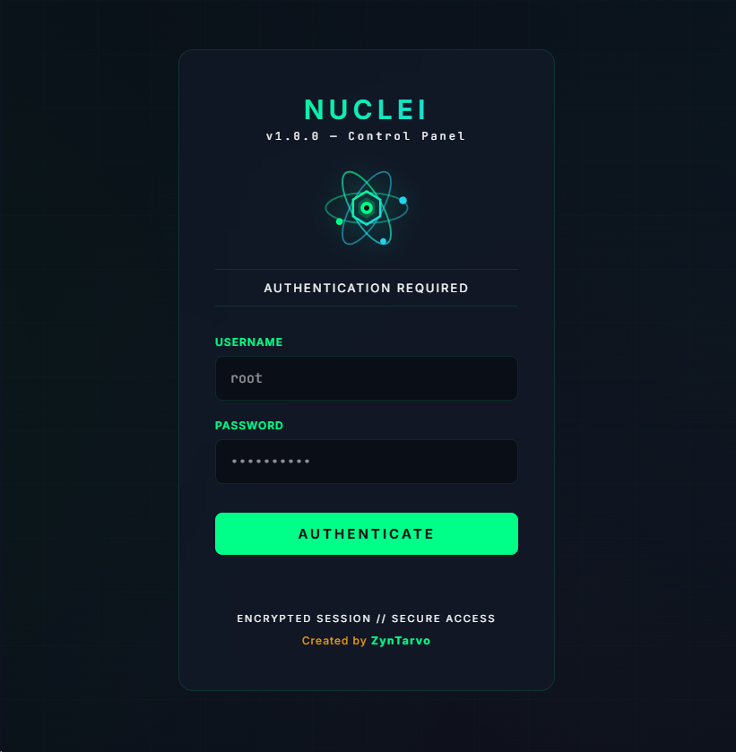
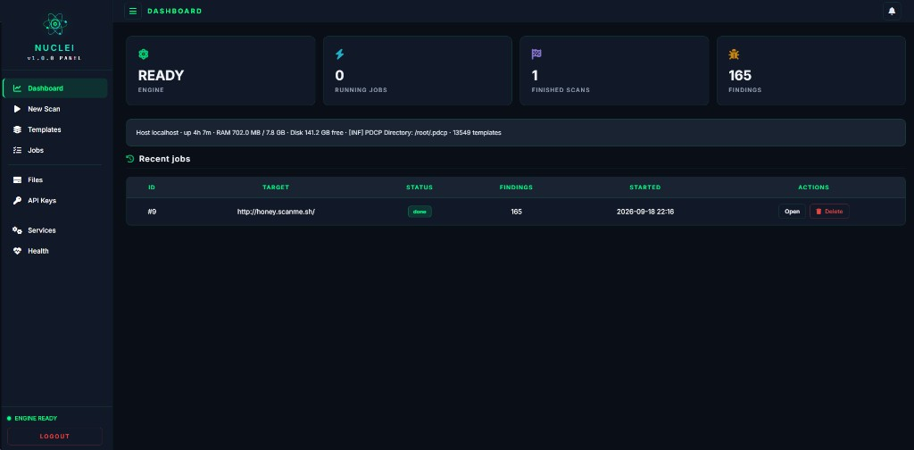
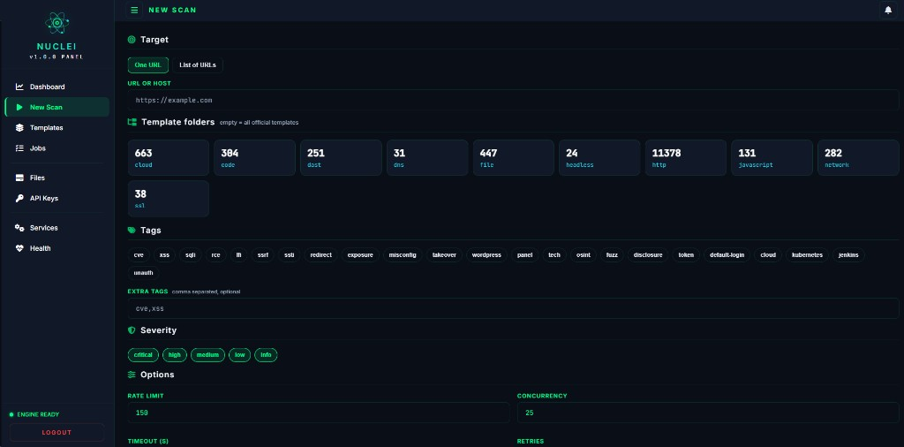
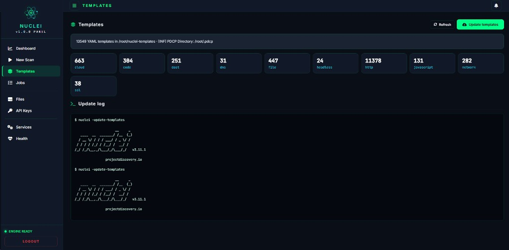
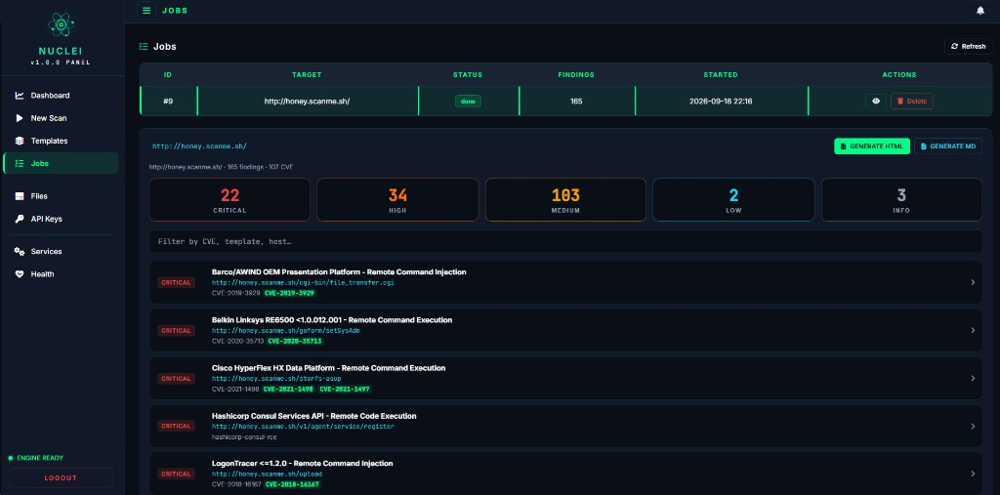
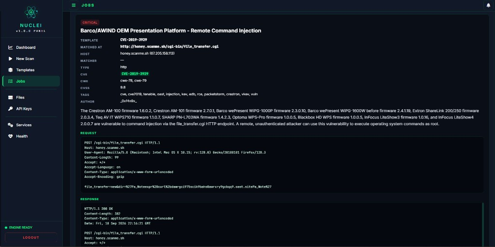
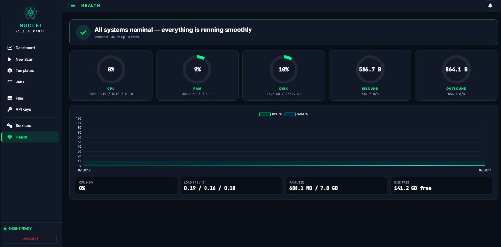

<p align="center">
  
</p>

<h1 align="center">Nuclei Control Panel</h1>

<p align="center"><b>A self-hosted web Control Panel + one-click auto-installer for <a href="https://github.com/projectdiscovery/nuclei">Nuclei</a></b></p>

<p align="center">
  <a href="https://t.me/zyntarvo"></a>
  &nbsp;
  
  &nbsp;
  
  &nbsp;
  
  &nbsp;
  
</p>

<p align="center"><b>Created by ZynTarvo</b> · Telegram: <a href="https://t.me/zyntarvo">@zyntarvo</a> · <i>Nothing Is Impossible</i></p>

---

A web **Control Panel** for [Nuclei](https://github.com/projectdiscovery/nuclei) — plus a fully automatic Windows installer.

No Linux wizardry. No coding. Enter the server IP and password, click **Install**, and get a working Nuclei scanner with a browser dashboard: pick targets, pick templates/tags/severity, run, watch the live log, and read every finding with full request/response — all from a mint/dark web UI.

Built for pentesters, bug-bounty hunters, and anyone who wants Nuclei running in minutes instead of fighting the terminal for hours.

- Auto-install on a fresh Ubuntu server (Go + Nuclei + nuclei-templates + the panel + systemd)
- Web panel with login (same credentials as SSH)
- **New Scan** — one URL or a list of URLs, choose template folders, tags, severity, rate/concurrency/timeout/retries
- **Jobs** — every scan with a live streaming log, per-domain severity cards, a searchable findings list, and a full per-vulnerability detail view (template, matched-at, host, CVE/CWE/CVSS, tags, author, description, **request**, **response**, cURL, references)
- **One-click reports** — export any job as a self-contained **HTML** or **Markdown** report where every finding is fully expanded
- **Templates** — 13,000+ official templates managed from the browser, one-click update, per-category counts
- **Files** — browse scan output and templates on the server
- **API Keys** — optional ProjectDiscovery Cloud (PDCP) key, stored only on your server (never in this repo)
- **Services / Health** — systemd control and live host metrics (CPU, RAM, disk, traffic)

## What is Nuclei?

[Nuclei](https://github.com/projectdiscovery/nuclei) by [ProjectDiscovery](https://projectdiscovery.io) is a fast, template-based vulnerability scanner. Instead of hard-coded checks, it runs **YAML templates** that describe exactly how to detect an issue, which makes it accurate (low false-positives) and endlessly extensible.

This panel installs the **official** Nuclei binary and the community **nuclei-templates** repository, and drives all of the engine's real capabilities:

| Nuclei capability | What it does | In the panel |
|---|---|---|
| **13,000+ templates** | Community + official detection templates, updated constantly | Templates page · one-click update · per-category counts |
| **Protocol coverage** | HTTP, DNS, TCP/network, SSL/TLS, file, headless (browser), JavaScript, code, DAST, cloud | Template-folder picker (http / dns / network / ssl / file / headless / javascript / code / dast / cloud) |
| **Tag filtering** | Run only the checks you want: `cve`, `rce`, `sqli`, `xss`, `lfi`, `ssrf`, `takeover`, `exposure`, `misconfig`, `default-login`, `wordpress`, `kubernetes`… | Tag chips + free-text extra tags |
| **Severity filtering** | Scope by `critical` / `high` / `medium` / `low` / `info` | Severity toggles |
| **CVE detection** | Thousands of CVE templates with CVE-ID, CWE and CVSS metadata | Shown on every finding + report |
| **Headless / DAST** | Browser-driven and fuzzing templates for dynamic testing | Runtime browser libraries installed automatically |
| **Rate control** | Rate limit, concurrency, timeout, retries | Options block on New Scan |
| **PDCP integration** | ProjectDiscovery Cloud Platform for template auth / upload | API Keys page (optional, your key stays on the box) |
| **Structured output** | JSONL findings with request/response, matched-at, extracted data | Parsed into the Jobs findings explorer + HTML/MD reports |

## Why this panel — the advantages

The engine is ProjectDiscovery's. What this project adds on top:

- **Zero-terminal install.** A Windows GUI (Tkinter + Paramiko) connects over SSH and installs everything itself — Go (`apt golang-go`, no broken tarballs), the Nuclei binary, `nuclei-templates`, the Flask panel, a Python venv, and a `systemd` service. Two buttons: **INSTALL** (full stack on a fresh VPS) or **INSTALL ONLY CP** (panel only, reuse an existing Nuclei).
- **Headless works out of the box.** `-headless` templates download a Chromium via go-rod that needs GUI shared libraries. The installer pre-installs them (`libatk`, `libcups`, `libgbm`, `libnss3`, …) with the right package names for Ubuntu 20.04 → 26.04, so headless/DAST templates run on a bare server with no manual fixing.
- **Long scans survive.** The service uses `systemd` with `KillMode=process`, and huge scans are launched so they keep running even if the panel restarts. Orphan headless Chromium processes are reaped automatically on stop/delete/abnormal exit.
- **Findings that read like a report.** Each job shows severity cards + a searchable list, and clicking any vulnerability opens the **full** detail — template, matched-at, host, CVE/CWE/CVSS, tags, author, description, and the raw **HTTP request and response** — the same information you'd dig out of the JSONL by hand.
- **Self-contained HTML / Markdown exports.** One click turns a job into a shareable report where **every** finding is expanded with request/response, cURL and references — perfect for handing to a client or a team.
- **Safe by default.** No API keys in the repository. The optional PDCP key is stored only on your server (mode `600`) and is never uploaded by the installer. Login is your SSH credential; sessions are encrypted.
- **The exact copy you tested.** The installer ships the whole `payload/` folder, so a new VPS reproduces byte-for-byte the panel you already validated.

## Install

**Requirements:** a Windows PC with Python 3, and a fresh Ubuntu 20.04 / 22.04 / 24.04 / 26.04 server (root SSH).

1. Clone this repository
2. Double-click `START.bat` (or run `python nuclei_setup.py`)
3. Fill in **IP**, **SSH port**, **username**, **password**
4. Choose a button:
   - **INSTALL** — full stack on a **fresh** server: Go, the Nuclei binary, `nuclei-templates`, headless browser libraries, the panel, and a `systemd` service
   - **INSTALL ONLY CP** — panel only. Reuses a Nuclei already on the box, (re)deploys the web panel and starts it

Panel URL: `http://YOUR_SERVER_IP:8443`
Login is the same as SSH (user + password).

> Prefer a single `.exe`? Run `build.bat` to produce `NUCLEI-INSTALLER-v1.0.0.exe` (PyInstaller, one-file).

## Login

<p align="center"></p>

Encrypted session, username / password, the atom mark. Works on desktop and mobile.

## Control Panel — every menu

### Dashboard

<p align="center"></p>

Home screen. Engine state, running jobs, finished scans, total findings, host summary (uptime, RAM, disk, template count) and a table of recent jobs with **Open** / **Delete**.

### New Scan

<p align="center"></p>

Everything you need to launch Nuclei, without a flag cheat-sheet:

| Section | What you set |
|---|---|
| **Target** | One URL/host, or a list of URLs |
| **Template folders** | Pick categories (`http`, `dns`, `network`, `ssl`, `file`, `headless`, `javascript`, `code`, `dast`, `cloud`). Empty = all official templates |
| **Tags** | Chips (`cve`, `xss`, `sqli`, `rce`, `lfi`, `ssrf`, `ssti`, `takeover`, `exposure`, `misconfig`, `default-login`, `wordpress`, `kubernetes`, …) plus free-text extra tags |
| **Severity** | `critical` / `high` / `medium` / `low` / `info` |
| **Options** | Rate limit, concurrency, timeout, retries |

Only runnable template folders are offered — non-runnable directories (`profiles` / `workflows` / `helpers`) and empty folders are filtered out so a scan never aborts with *"no templates found in path"*.

### Templates

<p align="center"></p>

The full `nuclei-templates` repository on the server. Total YAML count, per-category cards, **Update templates** (one click, live update log), and the current Nuclei version.

### Jobs

<p align="center"></p>

The heart of the panel. Every scan is a row (ID, target, status, findings, started, actions). Open a job and, **under that domain**, you get:

- **Severity cards** — Critical / High / Medium / Low / Info counts, click to filter
- **Search** — filter findings by CVE, template or host
- **Findings list** — severity pill, name, matched URL, CVE highlights
- **Live log** — the raw Nuclei output, streaming in real time
- **Generate HTML / Generate MD** — export the whole job as a report

Click any finding to open the full detail:

<p align="center"></p>

Template, matched-at, host, matcher, type, **CVE / CWE / CVSS**, tags, author, description, and the raw **Request** and **Response** (plus cURL and references) — the same view is baked into the exported HTML/MD reports, fully expanded for every vulnerability.

### Files

Browse the server from the browser: scan output and the templates tree, with size / modified columns.

### API Keys

Optional **ProjectDiscovery Cloud (PDCP)** key. The saved key is shown masked inside the field and revealed only when you click the eye. Stored only on your server (mode `600`) — **this repository ships empty**.

### Services

`systemd` manager so you are not SSH-ing just to restart a daemon. Filter running / custom / all, start / stop / restart, view logs. The `nuclei-panel` unit is tagged custom.

### Health

<p align="center"></p>

Live host metrics — CPU, RAM, disk, inbound/outbound traffic, load average — with a live chart. Cheap `/proc` reads only while the page is open.

## Layout

```
START.bat                 → launch the GUI installer
build.bat                 → build a one-file .exe (PyInstaller)
nuclei_setup.py           → SSH installer (Ubuntu 20.04–26.04)
payload/                  → panel that gets uploaded to the server
  app.py                  → Flask panel (scans, jobs, findings, reports, health)
  findings.py             → JSONL → findings parser + HTML/MD report export
  requirements.txt
  nuclei-panel.service    → systemd unit (KillMode=process)
  templates/              → login + dashboard (index.html)
  static/                 → atom logo + favicon
docs/screenshots/         → UI screenshots
```

## Support the work

If this panel saved you time and you want to say thank you, USDT on **Ethereum (ERC-20)** is enough:

```
0xFd051b2267b75C9c2513Cb9BAd546e3C51d5dB44
```

No pressure. Use the tool, learn, and pass it on.

## Contact

Telegram: [@zyntarvo](https://t.me/zyntarvo)

## Credits

- **Nuclei** & **nuclei-templates** — [ProjectDiscovery](https://github.com/projectdiscovery/nuclei)
- **Control Panel + Auto Installer** — [ZynTarvo](https://github.com/zyntarvo) · Telegram [@zyntarvo](https://t.me/zyntarvo)

<p align="center"><i>ZynTarvo — Nothing Is Impossible</i></p>
